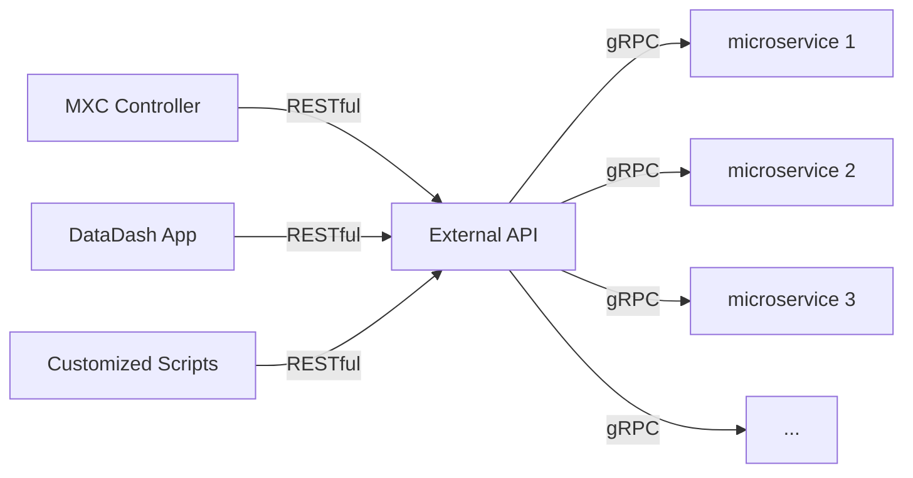

# external-api
External API takes external requests (RESTful or gRPC) then forward the request 
to corresponding microservice for further processing.



## Build API
APIs are defined by `.proto` files, since we are using `buf` to generate the gPRC stubs, please read
[here](https://github.com/bufbuild/buf) to install buf locally.

### Layout of .proto and configuration files
```
./
├── buf.gen.yaml
├── buf.work.yaml
├── extmcapi
│    ├── buf.lock
│    ├── buf.yaml
│    └── extmcapi.proto
├── gen
│    └── v1
│         ├── go
│         │    ├── extmcapi_grpc.pb.go
│         │    ├── extmcapi.pb.go
│         │    └── extmcapi.pb.gw.go
│         └── swagger
│              └── extmcapi.swagger.json
├── ...
```
To add new APIs for a different service, for example user service, follow steps:
1. add a new directory ./usersrvapi
```
./
├── buf.gen.yaml
├── buf.work.yaml
├── extmcapi
│    ├── buf.lock
│    ├── buf.yaml
│    └── extmcapi.proto
├── usersrvapi
├── gen
│    └── v1
│         ├── go
│         │    ├── extmcapi_grpc.pb.go
│         │    ├── extmcapi.pb.go
│         │    └── extmcapi.pb.gw.go
│         └── swagger
│              └── extmcapi.swagger.json
├── ...
```
2. create usersrvapi.proto, add file buf.yaml, for example
```yaml
version: v1
name: buf.build/gomxcorgapis/usersrvapi
lint:
  use:
    - DEFAULT
breaking:
  use:
    - FILE
deps:
  # here dependencies needs to be added
  - buf.build/googleapis/googleapis
```
Then we have:
```
./
├── buf.gen.yaml
├── buf.work.yaml
├── extmcapi
│    ├── buf.lock
│    ├── buf.yaml
│    └── extmcapi.proto
├── usersrvapi
│    ├── buf.yaml
│    └── usersrvapi.proto
├── gen
│    └── v1
│         ├── go
│         │    ├── extmcapi_grpc.pb.go
│         │    ├── extmcapi.pb.go
│         │    └── extmcapi.pb.gw.go
│         └── swagger
│              └── extmcapi.swagger.json
├── ...
```
3. generate `buf.lock`
```shell
cd ./usersrvapi
buf mod update
```
Then we have:
```
./
├── buf.gen.yaml
├── buf.work.yaml
├── extmcapi
│    ├── buf.lock
│    ├── buf.yaml
│    └── extmcapi.proto
├── usersrvapi
│    ├── buf.yaml
│    ├── buf.lock
│    └── usersrvapi.proto
├── gen
│    └── v1
│         ├── go
│         │    ├── extmcapi_grpc.pb.go
│         │    ├── extmcapi.pb.go
│         │    └── extmcapi.pb.gw.go
│         └── swagger
│              └── extmcapi.swagger.json
├── ...
```
4. modify `buf.work.yaml`, include new API directory
```yaml
version: v1
directories:
  - extmcapi
  - usersrvapi
```
5. generate go files and json files
```shell
make api
```
Then we have:
```
./
├── buf.gen.yaml
├── buf.work.yaml
├── extmcapi
│    ├── buf.lock
│    ├── buf.yaml
│    └── extmcapi.proto
├── usersrvapi
│    ├── buf.yaml
│    ├── buf.lock
│    └── usersrvapi.proto
├── gen
│    └── v1
│         ├── go
│         │    ├── usersrvapi_grpc.pb.go
│         │    ├── usersrvapi.pb.go
│         │    ├── usersrvapi.pb.gw.go
│         │    ├── extmcapi_grpc.pb.go
│         │    ├── extmcapi.pb.go
│         │    └── extmcapi.pb.gw.go
│         └── swagger
│             ├── usersrvapi.swagger.json
│             └── extmcapi.swagger.json
├── ...
```

## Proxy Server
Note that we must register gRPC server and service handler from endpoint for each service, before we start proxy server listener.


